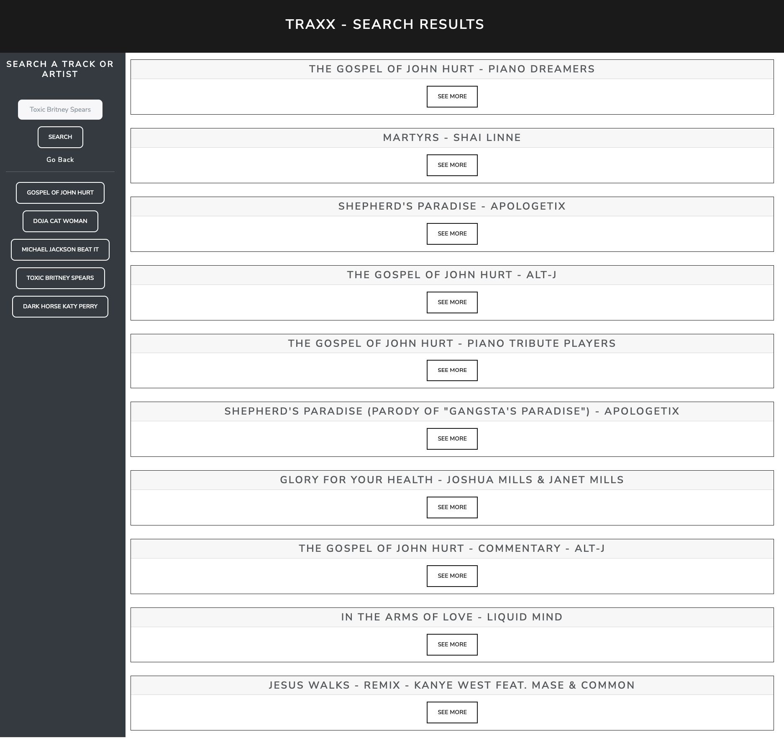

# traxx - Music Search Software

## David Aylward and Devon Faria

[Link to working page](https://devonfaria.github.io/traxx/)

## Table of Contents

* [Description](#description)
* [Visuals](#visuals)
* [Technologies](#technologies)
* [Licenses](#licenses)
* [Support](#support)
* [Roadmap](#roadmap)
* [Authors](#authors)
* [Contributions](#contributions)

## Description

Welcome to traxx - a music searching software that brings you countless versions of your favorite music. This is a browser-based application, so no installation necessary.

With algorithms on common search software like Google and Youtube prioritizing displaying the most popular results, it can make it harder for you hipsters to find covers, kareoke versions, and collaborations that artists have not widely promoted. That's why we created traxx, to help you deep dive into the amazing music that you haven't heard yet.

Our program uses three API calls to generate your results. First, it will search the Musixmatch database for tracks that fit your search criteria. The landing page will then switch to a results page with ten of the most relevant tracks. Once one result is chosen, we run an API fetch to get lyrics from Musixmatch, if present. It will also run an API fetch on Youtube to find the cooresponding video ID so we can generate an embedded video of the result chosen. 

The track page will display the track name, artist, a portion of the lyrics if available, and the cooresponding Youtube video embedded in the track page. Some Youtube videos will have restrictions that will not allow them to be embedded to our program, but the link will bring you to the video regardless.

Once a search has been initiated, the program will save the search query in localStorage so that it can generate previous searches as buttons to re-run a search easily.

## Visuals

The following layout is the landing page you can expect to see on your browser.

Once a search query is submitted, you will see the page change to this search page with ten results.

Once a 'See more' button is chosen on a particular result, the page will then display the track-related material in this format. 

If lyrics are not found upon initial search, then the following inamge will be displayed on the track page.  

## Technologies

* Musixmatch API
* Youtube API
* Bootstrap

## Licenses

The MIT License (MIT)

Copyright (c) 2022 Devon Faria

Permission is hereby granted, free of charge, to any person obtaining a copy of this software and associated documentation files (the "Software"), to deal in the Software without restriction, including without limitation the rights to use, copy, modify, merge, publish, distribute, sublicense, and/or sell copies of the Software, and to permit persons to whom the Software is furnished to do so, subject to the following conditions:

The above copyright notice and this permission notice shall be included in all copies or substantial portions of the Software.

THE SOFTWARE IS PROVIDED "AS IS", WITHOUT WARRANTY OF ANY KIND, EXPRESS OR IMPLIED, INCLUDING BUT NOT LIMITED TO THE WARRANTIES OF MERCHANTABILITY, FITNESS FOR A PARTICULAR PURPOSE AND NONINFRINGEMENT. IN NO EVENT SHALL THE AUTHORS OR COPYRIGHT HOLDERS BE LIABLE FOR ANY CLAIM, DAMAGES OR OTHER LIABILITY, WHETHER IN AN ACTION OF CONTRACT, TORT OR OTHERWISE, ARISING FROM, OUT OF OR IN CONNECTION WITH THE SOFTWARE OR THE USE OR OTHER DEALINGS IN THE SOFTWARE.

## Support

Contact us at devonfaria@gmail.com if you need assistance downloading or activating this repository.

## Roadmap

In the future of our project, we would like to add more search filters such as looking for covers, kareoke versions, original tracks, etc. more specifically. Also, we would like to alter our API fetch from Musixmatch to Genius, as Genius has a more robust library and more commonly has information like correct lyrics and video URLs.

## Authors

David Aylward
[Link to Github page](https://github.com/DavidAyl)

Devon Faria
[Link to Github page](https://github.com/devonfaria)

## Contributions

A huge thank you to Anthony Cooper, Sasha Peters, and Andy our guest TA for providing useful solutions to some of our variable scoping issues and CORS errors. This project would not have been possible without them. 